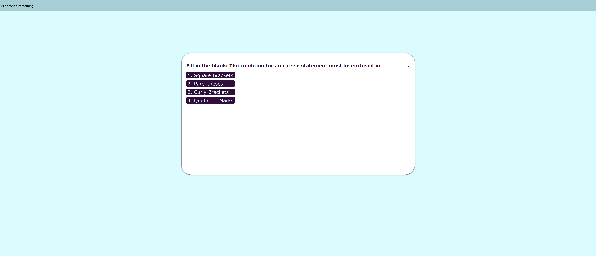

# Code Quiz
## Description
This application is a coding quiz for aspiring developers. They will have 60 seconds to complete the quiz. Each correct answer results in one point, while each incorrect answer results in a 10 second penalty. You can access the application [here](https://aaron-heath.github.io/code-quiz/). The application uses JavaScript to serve all of the content in one HTML page.

See the a screenshot below:

## Installation

N/A

## Usage

Press the 'Start Quiz' to begin. You will be prompted with the first question. After each question, you'll be prompted with the next unless time ends or there are no more questions. A tthe end of the quiz, you will be given your score and be able to enter your initials and save both to local storage. Any existing scores will be provided in a list below your score.

## Credits

N/A